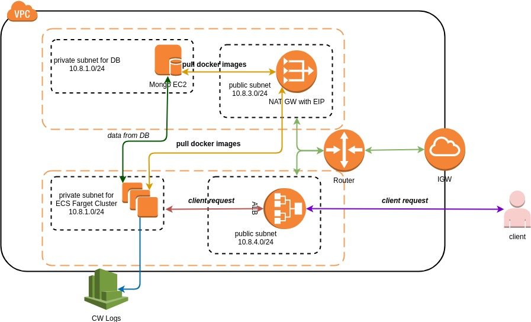

[](https://circleci.com/gh/ffoysal/kioshi/tree/master)

# Documentation Index

- [Overview](#Overview)
- [Api Architecture](#Architecture)
- [Run app locally](#Run-locally)
- [Run Test](#Run-Test)
- [Sanity Test](#Sanity-for-Any-Deployment)
- [Build Container & Run](#Build-Container)
- [Run using docker-compose](#Run-using-docker-compose)
- [Cloud Deployment](#Cloud-Deployments)
  - [Kubernetes Deployment (kops)](#Kubernetes-with-kops)
  - [Helm Deployment](#Helm-Deployment)
  - [AWS Deployment (terraform)](#AWS-Terraform)
- [CLI for API](#CLI-for-Api)
- [K8s-Application](k8s-application/README.md)

# Overview

Kioshi is a simple REST api which has only one purpose is to manage messages. The user will be able to create a message using `<uri>/messages` endpoint and should get the details about the messages. Specifically if a message is palindrome or not. The app has followed RESTful design pattern. The design tries to comply with the HTTP code for various operations. The successful operations and returned HTTP code has been described into the following table

| Operations | HTTP Verb | HTTP Returned Code | Comments |
| ---------- | --------- | ------------------ | -------- |
| Create message | POST `/messages` | 201 | request body `{"message":"racecar"}`, response body null, response header `Location:/messages/124fghk` |
| Get a message details | GET `/messages/124fghk` | 200 | response body will have message details |
| Update a message | PATCH `/messages/124fghk` | 204 | request body `{"message":"kayak"}`, no response body |
| Delete a message | DELETE `/messages/124fghk` | 204 | no response body|
| List messages | GET `/messages` | 200 | response has list of messages in the body|

The details api documentation would be found at the endpoint `<uri>/docs`

**CircleCi has been integrated and there is a `test` stage and code coverage report stored as artifact.**

## Architecture

The api is implemented using NodeJS, ExpressJS, MongoDB. The high level architecture of the app is as follows


- **Router**: It is a expressjs component that routes to various controller method based on request path.
- **Controller**: It is responsible to call proper service method and model based on the request
- **Service**: All the business logics are implemented in here.
- **Model**: Represents data model and handle database operations.

### In this guide all the commands and implementations are done on ubuntu

## Run locally

To run the app locally, pre-requisites

- Install `NodeJS`
- Install `npm`
- Install `MongoDB` or use mongo db docker container `docker run -d -p 27017:27017 --name mongodb mongo:4.0.4`


Once the pre-requisites are done, follow the steps in order
```
git clone https://github.com/ffoysal/kioshi.git
```
```
cd kioshi/server
```
```
npm install
```
It will download and install all the package dependency

_Make sure mongodb is running in `localhost` at port `27017`. If the DB is running somewhere else then export env as_

```
export MONGODB_URI=mongodb://<DB-HOST>:<PORT>/mms-db
```

```
npm start
```
It will open the port `3000` on `localhost`

For server health status http://localhost:3000/health

For api docs http://localhost:3000/docs

For api operation http://localhost:3000/messages

## Run Test

The test are written using `mocha`, `chai` and `supertest`  framework. During test app does not need real mongo db server instead it uses `mongodb-memory-server`.

To run the test 

```
git clone https://github.com/ffoysal/kioshi.git
cd kioshi/server
```
```
npm test
```
It will generate a mocha test report in console and generate a code coverage report using `nyc` framework.

## Sanity for Any Deployment

To quickly verify if a deployment has done successfully a file called `sanity.js` is provided into `server` folder. After finishing the deployment change the `baseURL` variable in `sanity.js` file and run `mocha sanity.js` it will verify all the api operations. If `mocha` command not found, install it `npm install mocha -g`

## Build Container

In order to deploy in the cloud easily a `Dockerfile` is provided to make docker container.

To build the container
```
git clone https://github.com/ffoysal/kioshi.git
cd kioshi
```
```
docker build . -t kioshi
```

It will create a docker image named `kioshi`. This container can be run by passing mongo db url as environment like this

```
docker run --rm -p 3000:3000 -e MONGODB_URI=mongodb://<DB_HOST>:27017/mms-db --name kioshi_app kioshi
```

_Note: change `DB_HOST` for your db._ DONT PUT `localhost` if your db is running in localhost. Instead use actual IP of the localhost as the app is running inside container.


Access the app

documentation: http://localhost:3000/docs

health check: http://localhost:3000/health

api: http://localhost:3000/messages

## Run using docker-compose

pre-requisites are

- [docker](https://docs.docker.com/install/) must be installed
- [docker-compose](https://docs.docker.com/compose/install/) must be installed

Follow the steps in order

```
git clone https://github.com/ffoysal/kioshi.git
```
```
cd kioshi
```
```
docker-compose up
```
_It will download mongodb docker container and start it. The app container will be built and start the app container._

The app will be running at port `3000` on `localhost`

For server health status http://localhost:3000/health

For api docs http://localhost:3000/docs

For api operation http://localhost:3000/messages

# Cloud Deployments

To make the cloud deployment easier the build system push the latest application docker image to docker hub. Have a look at the [Docker Registry](https://hub.docker.com/r/ffoysal/kioshi). Kubernetes or AWS ECS can easily pull the docker images from that pulic registry.

## Kubernetes with kops

We will use `kops` to deploy kubernetes cluster in **AWS**. Assuming [kops](https://github.com/kubernetes/kops) has been installed on your development machine as well as `aws-cli` and `kubectl`.

### Create an S3 bucket

As `kops` uses S3 bucket to store the state and configuration of your Kubernetes cluster:

```
aws s3api create-bucket \
    --bucket kioshi-k8s-store \
    --region us-east-1
```

_This bucket name may not be available please replace your bucket name here._

### Set environement vriables for easy life

```
export NAME=kioshi.com.k8s.local
export KOPS_STATE_STORE=s3://kioshi-k8s-store
```

### Create Cluster Config

This will create cluster with micro instances. So production please follow the recomanded size in [here](https://github.com/kubernetes/kops)
```
kops create cluster \
  --name=${NAME} \
  --zones=us-east-1a \
  --node-count=2 \
  --node-size=t2.micro \
  --master-size=t2.micro
```

### Build the cluster

```
kops update cluster ${NAME} --yes
```
You will see the output like this. But the cluster creation has not been completed yet.

```
Cluster is starting.  It should be ready in a few minutes.
```

### Verify Cluster

Cluster creation will take couple of minitues. Validate if the cluster creation is done using the command
```
kops validate cluster
```
The above command will produce all the node info as well as
```
Your cluster kioshi.com.k8s.local is ready
```

### Check all nodes are ready

```
kubectl get nodes
```
Running the above command will produce something like
```
NAME                            STATUS   ROLES    AGE   VERSION
ip-172-20-37-130.ec2.internal   Ready    master   3h    v1.11.9
ip-172-20-40-220.ec2.internal   Ready    node     3h    v1.11.9
ip-172-20-52-48.ec2.internal    Ready    node     3h    v1.11.9
```
if not wait until output looks like that.

### Deploy The Service

To checkout and deploy the service do the following commands in order
```
git clone https://github.com/ffoysal/kioshi.git
```
```
cd kioshi/kubernetes
```
```
kubectl apply -f .
```

Verify if pods are in running state, if not pelase wait and check again
```
kubectl get pods
```
will produce something like
```
NAME                                 READY   STATUS    RESTARTS   AGE
kioshi-deployment-647558c554-5vvw8   1/1     Running   1          1h
kioshi-deployment-647558c554-sd67m   1/1     Running   1          1h
mongo-788bf5f674-2hmqh               1/1     Running   0          1h
```
Don't worry about `RESTART` colloumn. The app restart if db is not available. DB should be available eventually.

To list all the servicees please do
```
kubectl get service
```
output will be
```
api     LoadBalancer   100.71.140.141   <uri>.us-east-1.elb.amazonaws.com   80:31619/TCP   3h
kubernetes   ClusterIP      100.64.0.1       <none>                                                                    443/TCP        3h
mongo        ClusterIP      100.68.179.157   <none>                                                                    27017/TCP      1h
```
The `api` service can be accessed by this url `<uri>.us-east-1.elb.amazonaws.com`

The supported paths by the app are 

health check: `<uri>.us-east-1.elb.amazonaws.com/health`

api documentation: `<uri>.us-east-1.elb.amazonaws.com/docs`

api: `<uri>.us-east-1.elb.amazonaws.com/messages`


All the supported operations and examples are provided in `/docs` path.

The api endpoint are in the path `/messages`

To verify the apis please use `curl` or `postman`

_Note: `try out` button in swagger ui will not work for this deployment._

### Delete Cluster

To cleanup, delete the kubernetes cluster
```
kops delete cluster --name=${NAME} --yes
```

## AWS Terraform

The high level architecture for AWS deployment is below. MongoDB container is running in EC2 instance and app container is running in ECS Fargate.


_Note: for simplicity all security groups, target group, ECS service are not shown in the diagram_

The `terraform` code is written in the version of `0.11.7`. Please download the [terraform 0.11.7](https://releases.hashicorp.com/terraform/0.11.7/) for your OS. Assumming the AWS credentials are stored in `$HOME/.aws/credentials` with default profile. And the infrastructure will be created in `us-east-1` region.

Follow the steps below in order to deploy the infrastructure in AWS.
```
git clone https://github.com/ffoysal/kioshi.git
```
```
cd kioshi/terraform
```
```
terraform init
```

_Note: It will load all the terraform moudles._

```
terraform plan
````
it will show how many resources and what resources will be created. Currently 32 resources will be created. And the output for the above command will have something like this

```
Plan: 32 to add, 0 to change, 0 to destroy.
```

```
terraform apply -auto-approve
```
it will start creating AWS resourcess. It will take couple of miniutes. When finished the last lines will be something like this
```
Apply complete! Resources: 32 added, 0 changed, 0 destroyed.

Outputs:

alb = mms-kio-alb-124578.us-east-1.elb.amazonaws.com
```

_Note: for every deployment this number `124578` in the URL is different_

go to http://mms-kio-alb-124578.us-east-1.elb.amazonaws.com/health
It will return `503` as because MongoDB is running on EC2 instance which has not been ready state yet. Detail logs can be found at cloudwatch log group `mms-kio-ecs`. Wait 2/3 minutes the app will be ready.


health check: http://mms-kio-alb-124578.us-east-1.elb.amazonaws.com/health

api documentation: http://mms-kio-alb-124578.us-east-1.elb.amazonaws.com/docs

api: http://mms-kio-alb-124578.us-east-1.elb.amazonaws.com/messages

To test REST api client tools would be [postman](https://www.getpostman.com/) or `curl` or use [mms-cli](#CLI-for-Api)

To cleanup the resources

```
terraform destroy -auto-approve
```

It will take couple of miniutes to finish. It will delete all the resources created for the deployemnt.

## Helm Deployment

Setup kubernetes cluster by following [Kubernetes Deployment (kops)](#Kubernetes-with-kops). Dont use `kubectl` to deploy the pods.

Install [Helm](https://helm.sh/docs/using_helm/#installing-helm). I found this is enough for installation

```
curl -LO https://git.io/get_helm.sh
chmod 700 get_helm.sh
./get_helm.sh
```

The above script will take the latest helm and install it.

verify helm is installed
```
helm version
```

will show output something like this

```
Client: &version.Version{SemVer:"v2.14.1", GitCommit:"5270352a09c7e8b6e8c9593002a73535276507c0", GitTreeState:"clean"}
Server: &version.Version{SemVer:"v2.14.1", GitCommit:"5270352a09c7e8b6e8c9593002a73535276507c0", GitTreeState:"clean"}
```
_Note: `Server` will not be shown unless finish `helm init` first._

Since we are using `KOPS` with `AWS` to create kubernetes cluster we need to setup a service account and associate that account with the cluster role `cluster-admin`  in the cluster for `tiller`.

```
kubectl create serviceaccount -n kube-system tiller
kubectl create clusterrolebinding tiller-cluster-rule --clusterrole=cluster-admin --serviceaccount=kube-system:tiller
```

Initialize `helm` with the service account named `tiller`

```
helm init --service-account tiller
```

Now verify helm again
```
helm version
```

Now follow the steps to deploy this service

```
git clone https://github.com/ffoysal/kioshi.git
cd kioshi/helm
helm install mms/
```

Follow the on screen message for details after the above command.

To delete the service, first get the helm released name `helm list` then do `helm delete <RELEAE_NAME>`


## CLI for Api

A custom cli (`mms-cli`) tool has been implemented for this REST api. The `mms-cli` suppport operations (create, get, update, delete, list) and make api calls to the REST server. The cli tool is implemented using `go` and the code is located [here](./mms-cli).

Download the latest release of cli for your OS from [here](https://github.com/ffoysal/kioshi/releases)


### Example CLI Run in Ubuntu

Download package for linux and extract it. There is an executable file `mms-cli_linux_amd64`

For easy to use rename file 
```
mv mms-cli_linux_amd64 mms-cli
```
Make the file executable

```
chmod +x mms-cli
```
Move the file to `/usr/local/bin`
```
mv mms-cli /usr/local/bin
```

The CLI tool help is self explenetory.

`mms-cli` try to find api server from the environment variable `MMS_URI`. So running it without setting environment variable will show the output

```
Please export the environment variable MMS_URI (.i.e. export MMS_URI=http://localhost:3000)
It is the URI where the REST api server is running
```
export the environement variable 
```
export MMS_URI=http://localhost:300
```
assuming the api is running on local host.
then run 
```
mms-cli
```
The output will be like this
```

	mms-cli is a client tool for rest api Message Management Service (mms).
	You can create, get, delete, update, list messages.

Usage:
  mms-cli [command]

Available Commands:
  create      Create a message
  delete      Delete a message
  get         Get a message details
  help        Help about any command
  list        List all the message
  update      Update a message

Flags:
  -h, --help   help for mms-cli

Use "mms-cli [command] --help" for more information about a command.
```

# Issues/Comments/Suggestions

if you find an issues or have any question, comments, suggestions please create an issue.
